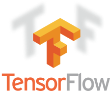

# 수어지교   
농인(청각 장애인)과 청인간의 원활한 소통에 도움을 주고자 청인의 목소리와 농인의 수어를 텍스트로 변환하는 서비스 입니다.

## 설치(Install)
1 프로젝트 Download
```git
git clone https://github.com/SHINMH/sign_translator_django.git
```
2 Openpose Download    
[Openpose Release](https://github.com/CMU-Perceptual-Computing-Lab/openpose/releases) 에서 CPU버전 다운 받는다.   
받은 폴더를 `openpose_source`로 변경 후 `sign_translator_django` 폴더 아래에 넣는다.


## 실행 방법
```
manage.py runsslserver --certificate development.crt --key development.key
```

## 사용 방법
    
(1) 음성을 텍스트로 변환하기 위한 버튼   
(2) 수어영상을 촬영하기 위한 버튼   
(3) 음성과 수어 해석한 결과를 텍스트로 보여주는 영역   
(4) 수어가 해석된 결과를 보여주는 영역   
&nbsp; 정확도가 50% 미만인 경우 붉은 글씨로 표시된다.

## 사용 모듈
|모듈|모듈|
|:---:|:---:|
|||
|||

## 모델
   
   
GRU모델을 사용했고 설계는 GRU 층이 총 5개, hidden layer 256개 사용했다.

## 해석 단어
총 35개의 단어
```
가렵다, 고열, 골절, 기절하다, 독극물, 두드러기생기다, 말벌, 
반점생기다, 발, 발작, 복톧, 부러지다, 삼키다, 숨을안쉬다,
심장마비, 쓰러지다, 아기, 어지러움, 열나다, 유리, 자상, 
장난감, 절단, 질식, 창백하다, 추락, 출산, 출혈, 
친구, 탈골, 토하다, 피나다, 함몰되다, 호흡곤란, 화상
```